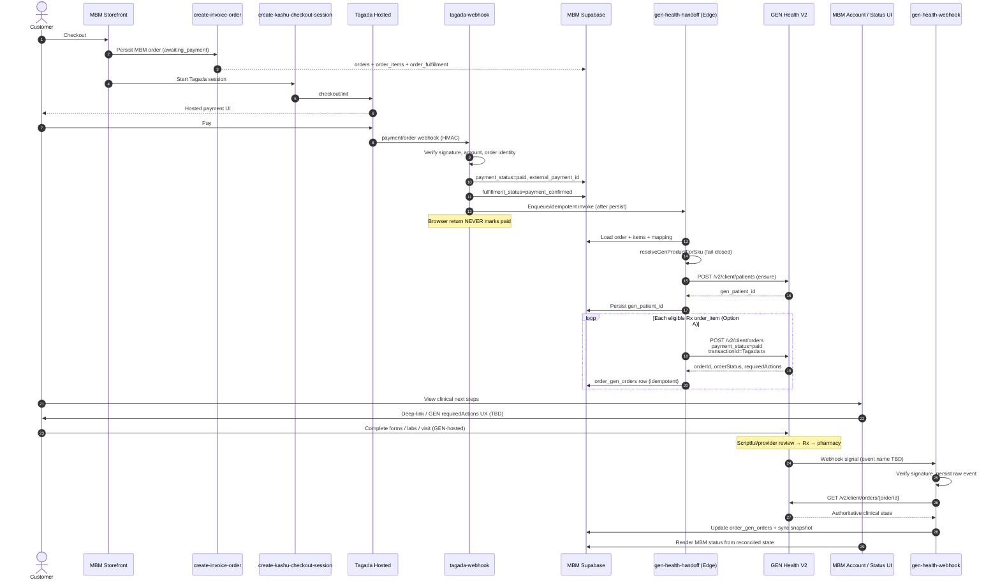

# GEN Health V2 Integration Design — Phase 12C

**Mode:** DESIGN-ONLY  
**Baseline branch:** `deploy/ach-launch-clean-2026`  
**Baseline SHA:** `5473777fa21c54f084ca86b330ea03f93c7152eb`  
**Date:** 2026-08-21  

**Non-goals for this phase:** no implementation, no live API calls, no DB apply, no Tagada/GEN changes, no commit/push.

Related artifacts:

- Phase 12A architecture audit (conversation)
- Phase 12B mapping: `docs/genhealth-migration-matrix.md` / `.json`

Where GEN V2 request/response fields are not confirmed against an authoritative OpenAPI/reference dump in-repo, fields are marked:

**TBD — VERIFY AGAINST GEN V2 API REFERENCE**

Confirmed endpoints (per owner / GEN V2 guide):

| Method | Path | Purpose |
|---|---|---|
| `POST` | `/v2/client/patients` | Create / ensure patient |
| `POST` | `/v2/client/orders` | Create clinical order |
| `GET` | `/v2/client/orders/{orderId}` | Authoritative order read |
| `GET` | prescriptions by order | Prescription listing (**exact path TBD — VERIFY**) |

Confirmed paid-external pattern:

> Charge through your processor → send `order.payment_status = "paid"` → optional `transactionId`

---

## 1. Target architecture



### Authority model (summary)

| Domain | Authority |
|---|---|
| Card charge / recurring membership billing / commerce tx ID | **Tagada** |
| Clinical order, requiredActions, intake, Rx, pharmacy routing/status | **GEN** (via GET order as SoT) |
| MBM order identity, SKUs, snapshots, Tagada↔GEN reconciliation, storefront display, audit | **MBM Supabase** |

**Hard rule:** GEN receives `payment_status="paid"` only after MBM has verified Tagada payment. Never use GEN payment fields to prove Tagada success.

---

## 2. Payment authority model

### Tagada is authoritative for

- Customer payment transaction success/failure
- Recurring membership rebills (financial)
- Hosted card checkout session
- MBM commerce external payment / transaction identifiers (`orders.external_payment_id`, session IDs)

### GEN is authoritative for

- Clinical order lifecycle
- `requiredActions`
- Intake / forms / uploads / visit scheduling (as returned by GEN)
- Provider evaluation outcome
- Prescription generation
- Pharmacy routing and pharmacy fulfillment status
- Clinical eligibility

### MBM / Supabase is authoritative for

- `orders.id` / `public_order_number`
- MBM SKU + product/variant snapshots on `order_items`
- Mapping tables (`gen_sku_map`, `order_gen_orders`)
- Internal handoff status / retry / audit
- Storefront-facing status composition (commerce + clinical)

### Explicit non-authority

- GEN must **not** independently prove payment
- Tagada must **not** drive clinical approval
- Browser / Vite must **never** mark `payment_status=paid`
- Membership rebill success must **not** auto-create medication GEN orders (unchanged rule)

---

## 3. Patient contract — `ensureGenPatient()`

### Conceptual location

`supabase/functions/_shared/genHealth.ts` → `ensureGenPatient(input)`  
Invoked only from Edge (handoff / admin repair). Never from React.

### Input (MBM → GEN)

| Field | Source | Notes |
|---|---|---|
| MBM customer / profile ID | `customer_profiles.id` / `auth.users` | Internal correlation |
| email | checkout / profile | Required for reuse semantics |
| first_name / last_name | checkout form / profile | |
| phone | checkout / profile | |
| DOB | **TBD — VERIFY** if GEN requires | May be collected in GEN requiredActions instead |
| shipping / billing address | order shipping fields | PO Box handling: GEN may reject — map to `GEN_ERROR` / action_required |
| Other GEN-required patient fields | **TBD — VERIFY AGAINST GEN V2 API REFERENCE** | Do not invent |

### Behavior

1. Read stored `customer_profiles.gen_patient_id` (proposed additive column) or equivalent lookup table.
2. If present → **reuse** (no create) unless force-repair flag set by admin.
3. If absent → `POST /v2/client/patients`.
4. Persist returned GEN patient ID server-side.
5. If GEN identifies existing patient by email and returns that ID → store and continue.
6. Never expose GEN API secret to browser (`GEN_HEALTH_API_KEY` Edge secret only — never `VITE_*`).

### Idempotency

- Key: `mbm_customer_id` (and/or email hash) → single `gen_patient_id`.
- Concurrent handoffs: use DB unique constraint on `gen_patient_id` / advisory lock / `ON CONFLICT` pattern so only one create wins.
- Retries after success: short-circuit on stored ID.

### Duplicate email / mismatch

| Case | Handling |
|---|---|
| GEN returns existing patient for email | Persist that ID; continue |
| Stored ID ≠ GEN email lookup | `GEN_ERROR` + admin review; do not silently overwrite without audit |
| Partial create (timeout after success) | Next retry: prefer lookup-by-email if GEN supports it (**TBD — VERIFY**); else admin reconcile |
| Validation failure (missing DOB etc.) | `GEN_PATIENT_PENDING` / `GEN_ACTION_REQUIRED`; payment remains paid |

### Retry rules

- Transient (5xx, timeout, 429): exponential backoff, max N attempts, status `GEN_RETRY_REQUIRED`
- Permanent (4xx validation): stop auto-retry; surface admin + customer messaging
- Never mark order unpaid due to patient failure

---

## 4. Product / SKU resolution — `resolveGenProductForSku(mbmSku)`

### Source

Future table `public.gen_sku_map` (draft SQL companion file).  
Populated from Phase 12B matrix once GEN IDs exist. **Does not replace** `kashu_sku_map` (Tagada commerce).

### Return

```text
gen_client_product_id
gen_medication_pairing_id   # optional but preferred when known
therapy_family
mapping_status              # ACTIVE|READY|BLOCKED|STALE|UNPAIRED|DEPRECATED|CURRENT
active                      # boolean
medication_cost_cents       # optional analytics
shipping_cost_cents         # optional analytics
replaces_mbm_sku            # if this row is successor
```

### Fail-closed

Handoff **must abort** GEN order create when:

- no row for SKU
- `active = false`
- `mapping_status` ∉ `{ACTIVE, READY}`
- `gen_client_product_id` null/empty

Storefront (future Phase 12D+): products with `BLOCKED|STALE|UNPAIRED|DEPRECATED` must not be purchasable. **Do not alter storefront in 12C.**

### Relation to Tagada

```text
MBM SKU → kashu_sku_map → Tagada variant/price   (commerce)
MBM SKU → gen_sku_map   → GEN clientProductId    (clinical)
```

Never use Tagada `priceId` as clinical identifier.

---

## 5. GEN order contract — `createGenOrderForPaidMbmOrder()`

### Preconditions

1. MBM `orders.payment_status = 'paid'`
2. Tagada webhook signature verified for the payment that set paid
3. Verified Tagada transaction identifier persisted (`orders.external_payment_id` or dedicated column)
4. Amount equality already enforced by Tagada webhook path (mismatch → under review; **no GEN handoff**)
5. For each eligible line: `resolveGenProductForSku` succeeds

### Known / intended GEN order fields

| Field | Value | Confidence |
|---|---|---|
| Patient reference | GEN patient ID from `ensureGenPatient` | Confirmed pattern |
| Product | GEN `clientProductId` from map | Confirmed naming in guide (“clientProductId”) |
| `payment_status` | `"paid"` | Confirmed |
| `transactionId` | Verified Tagada transaction ID | Confirmed optional/supported |
| Quantity / SKU-specific payload | **TBD — VERIFY AGAINST GEN V2 API REFERENCE** | |
| Shipping address | **TBD — VERIFY** | |
| External / client order reference (MBM public_order_number) | **TBD — VERIFY** (strongly recommended if supported) | |
| Line-level vs order-level product array | **TBD — VERIFY** (drives Option A vs B) | |

### Persist on success (per GEN clinical order)

- `gen_order_id`
- `gen_order_status` / clinical status snapshot
- `required_actions_json`
- `tagada_transaction_id`
- `gen_client_product_id`
- `created_at` / `last_synced_at`

### Idempotency (critical)

Tagada webhooks may deliver multiple times.

**Idempotency key (logical):**

```text
(mbm_order_id, mbm_order_item_id)  -- Option A preferred
```

or if GEN supports client-supplied idempotency key:

```text
idempotency_key = "mbm:" + order_id + ":item:" + order_item_id
```

**TBD — VERIFY** whether GEN accepts Idempotency-Key header or client reference field.

**Algorithm:**

1. Begin handoff only if payment paid.
2. For each eligible item, `SELECT` existing `order_gen_orders` row.
3. If `gen_order_id` present → skip create; optionally `GET` to refresh.
4. If row in `GEN_ORDER_PENDING` with recent attempt → retry carefully / backoff.
5. Insert pending row with unique `(order_id, order_item_id)` **before** or via upsert, then POST GEN.
6. On GEN success, update same row with `gen_order_id`.
7. Unique constraint on `gen_order_id` prevents duplicate storage.

Duplicate webhook after success → no second GEN POST.

---

## 6. Multi-item cart model

### Problem

MBM carts can contain multiple Rx lines (+ IPV/FUV/labs/accessories/shipping).  
GEN clinical products may become **independent clinical orders**.

### Option A (preferred until V2 multi-product order confirmed)

**One GEN order per prescription `order_item`.**

```text
MBM order (1)
 └─ order_item SEM vial     → GEN order A
 └─ order_item estradiol    → GEN order B
 └─ order_item IPV          → NOT a GEN medication order (see visits)
 └─ order_item Lab Kit      → NOT auto-POST as med (see labs)
 └─ accessory / shipping    → no GEN clinical order
```

**Pros:** Matches likely GEN independence; clear denial/refund granularity; simpler pairing.  
**Cons:** Multiple GEN creates per checkout; more webhook noise.

### Option B

One GEN order with multiple products — **only if** V2 API confirms multi-product payload.

**Status:** Not assumed. Mark **TBD — VERIFY AGAINST GEN V2 API REFERENCE**.

### Recommendation

Implement **Option A** as the default design. Revisit Option B only after API confirmation.

### Table: `order_gen_orders`

Links MBM parent order to zero-or-more GEN clinical orders (see schema draft).

Eligible lines for GEN medication handoff:

- `requiresPrescription` / Rx therapy SKUs in `gen_sku_map` ACTIVE|READY
- Exclude accessories, shipping SKUs, and (initially) PC visit/lab lines until visit/lab migration phases

---

## 7. Database design (draft only — do not apply)

See `docs/GEN_HEALTH_V2_SCHEMA_DRAFT.sql`.

### Summary

| Object | Purpose |
|---|---|
| `customer_profiles.gen_patient_id` | Additive GEN patient reference |
| `gen_sku_map` | MBM SKU → GEN clientProductId / pairing / costs / status |
| `order_gen_orders` | MBM order_item → GEN order idempotent link |
| `gen_webhook_events` | Raw webhook inbox + processing result |
| `gen_sync_events` | Optional audit of GET syncs / handoff attempts |
| `orders.gen_handoff_status` (optional) | Aggregate rollup for UI |

**Do not** rewrite historical SKUs, Tagada IDs, or order line snapshots.

### Aggregate handoff status (optional column or derived)

`GEN_NOT_STARTED` → … → `GEN_COMPLETE` / `GEN_ERROR` (see §10).

---

## 8. GEN service boundary

### Module

`supabase/functions/_shared/genHealth.ts` (conceptual)

| Method | Role |
|---|---|
| `genRequest(path, init)` | Authenticated server HTTP; timeouts; structured errors |
| `ensureGenPatient(input)` | §3 |
| `resolveGenProduct(mbmSku)` | DB map lookup fail-closed |
| `createGenOrder(input)` | §5 |
| `getGenOrder(genOrderId)` | Authoritative clinical read |
| `listGenPrescriptions(genOrderId)` | Path TBD — VERIFY |
| `syncGenOrder(orderGenOrdersId)` | GET + persist snapshot |

### Edge Functions (future)

| Function | Role |
|---|---|
| `gen-health-handoff` | Post-paid create patient/orders (idempotent) |
| `gen-health-webhook` | Inbound signals |
| `gen-health-sync` | Admin/cron repair GET sync |
| `tagada-webhook` | Remains payment authority; invokes handoff after paid persist |

### Secret storage

| Secret | Location |
|---|---|
| `GEN_HEALTH_API_KEY` / base URL | Supabase Edge secrets only |
| Tagada secrets | Existing Edge secrets |
| Never | `VITE_*`, frontend, GitHub, DB plaintext, logs |

---

## 9. Post-payment handoff

### Decision: prefer **B — separate function after payment persistence**

| Option | Pros | Cons |
|---|---|---|
| A. Sync GEN inside `tagada-webhook` | Simple | Webhook timeouts; couples payment ack to GEN latency; harder retries |
| **B. Persist paid → invoke `gen-health-handoff`** | Payment ack fast; retries isolated; idempotent job pattern | Extra function; eventual consistency window |

### Recommended flow

1. `tagada-webhook` verifies HMAC + amount + order.
2. Persist `payment_status=paid` + payment IDs + `payment_confirmed`.
3. Insert/upsert handoff intent (`gen_sync_events` or `orders.gen_handoff_status=GEN_ORDER_PENDING`).
4. Invoke `gen-health-handoff` (async fire-and-forget with signed internal call, or queue).
5. Handoff runs idempotent patient + order creates.
6. If handoff fails: payment stays paid; status `GEN_RETRY_REQUIRED`; admin/cron retries.

**Synchronous GEN inside webhook is discouraged** except maybe a best-effort non-blocking trigger.

Feature flag: `GEN_HEALTH_ENABLED=false` (default) short-circuits handoff.

---

## 10. Failure / retry model

### Clinical / handoff statuses

| Status | Meaning |
|---|---|
| `GEN_NOT_STARTED` | Paid or unpaid; handoff not attempted |
| `GEN_PATIENT_PENDING` | Patient create in flight / missing fields |
| `GEN_PATIENT_CREATED` | Patient ID stored |
| `GEN_ORDER_PENDING` | Order POST in flight |
| `GEN_ORDER_CREATED` | GEN order ID stored |
| `GEN_ACTION_REQUIRED` | requiredActions outstanding |
| `GEN_PROVIDER_REVIEW` | Provider evaluation in progress |
| `GEN_APPROVED` | Clinically approved (from GEN GET) |
| `GEN_DENIED` | Provider denied |
| `GEN_PHARMACY` | Pharmacy phase |
| `GEN_SHIPPED` | Shipped (GEN SoT) |
| `GEN_COMPLETE` | Terminal success |
| `GEN_ERROR` | Permanent/local mapping error |
| `GEN_RETRY_REQUIRED` | Transient failure; auto/manual retry |

Exact mapping from GEN `orderStatus` strings → **TBD — VERIFY AGAINST GEN V2 API REFERENCE**.

### Scenario matrix

| Scenario | Payment | Handoff | Customer | Ops |
|---|---|---|---|---|
| GEN unavailable after paid | stays paid | `GEN_RETRY_REQUIRED` | “Processing clinical setup” | Retry job |
| Patient create fails validation | stays paid | `GEN_PATIENT_PENDING` / ERROR | Complete profile / contact support | Fix data |
| Mapping missing / BLOCKED | stays paid* | `GEN_ERROR` | Support; ideally prevented pre-checkout later | Fix `gen_sku_map` |
| Order create timeout | stays paid | retry; idempotent | Wait | Monitor |
| Duplicate Tagada webhook | paid once | no duplicate GEN order | — | — |
| GEN webhook before local row | — | persist event; reconcile by client ref / tx id if possible | — | Attach when handoff completes |
| Provider denies after payment | paid | `GEN_DENIED` | Messaging + refund path | Manual Tagada refund TBD |
| Pharmacy reject | paid | `GEN_ERROR` / pharmacy status | Support | Ops + refund policy |
| PO Box rejected | paid or pre-check | `GEN_ACTION_REQUIRED` / ERROR | Update address | — |
| Forms incomplete | paid | `GEN_ACTION_REQUIRED` | Complete GEN actions | — |

\*Better: block purchase when mapping not READY (future storefront). If paid already, never un-pay automatically.

**Payment success must NEVER be rolled back solely because GEN is temporarily unavailable.**

---

## 11. Refund model

GEN docs: provider denial does **not** automatically refund the patient.

### Future denial flow (design)

```text
GEN GET/webhook → GEN_DENIED
→ MBM order/item flag: action_required / refund_required
→ Admin reviews
→ Tagada refund path (TBD — existing Tagada refund API not designed here)
→ MBM payment_status may become refunded
→ Fulfillment canceled/refunded per canAdvanceFulfillment rules
```

- Do **not** assume GEN refunds Tagada
- Do **not** auto-refund in Phase 12D without owner policy
- Multi-item Option A: deny one GEN order without necessarily denying sibling lines

---

## 12. Webhook model — `gen-health-webhook`

### Requirements

1. Signature verification (**algorithm TBD — VERIFY**)
2. Replay protection (timestamp tolerance + event id uniqueness)
3. Persist raw body to `gen_webhook_events` before business logic
4. Idempotent processing (`event_id` unique)
5. **Do not trust webhook payload as final clinical state**
6. On signal → `GET /v2/client/orders/{orderId}`
7. Persist GET result as authoritative clinical snapshot
8. Update `order_gen_orders` + derived MBM UI status

### Likely subscription categories (names unverified)

| Category | Placeholder |
|---|---|
| Order status changed | TBD — VERIFY GEN WEBHOOK EVENT NAME |
| Required actions updated | TBD — VERIFY GEN WEBHOOK EVENT NAME |
| Provider decision | TBD — VERIFY GEN WEBHOOK EVENT NAME |
| Prescription available | TBD — VERIFY GEN WEBHOOK EVENT NAME |
| Pharmacy / shipment | TBD — VERIFY GEN WEBHOOK EVENT NAME |

### Ordering hazard

If webhook arrives before `order_gen_orders.gen_order_id` exists:

1. Store event as `unmatched`
2. Attempt match via MBM client reference / transactionId if GEN echoes them (**TBD — VERIFY**)
3. Cron re-attach after handoff succeeds

---

## 13. RequiredActions UX

GEN create/GET returns `requiredActions`. MBM must **not** invent parallel clinical requirements.

### Design

```text
GEN requiredActions[]
  → persist on order_gen_orders.required_actions_json
  → Account portal “Clinical next steps” panel
  → CTA: deep link / GEN hosted session / embedded component
```

Exact continuation mechanism (**hosted checkout component vs redirect URL**) = **TBD — VERIFY**.

Potential action types (illustrative, not authoritative): forms, labs, uploads, visit scheduling.

Until UX confirmed, portal can show:

- status = `GEN_ACTION_REQUIRED`
- opaque list of action titles from GEN JSON
- support contact fallback

---

## 14. Provider visit migration (Phase 12D/12E concern)

**Do not remove** current MBM IPV/FUV injection (`injectProviderVisit`).

### Risk

Duplicate visit charge / duplicate appointment if GEN also requires a visit.

### Design direction

1. Short term: MBM continues to bill IPV/FUV; GEN visit requirements may be clinical-only (no second commerce charge) — **policy TBD**
2. Medium term: map GEN requiredActions visit → suppress MBM auto-inject when GEN owns visits
3. Long term: single visit commerce owner (MBM **or** GEN), never both

Track as explicit Phase 12D/12E reconciliation work. No code in 12C.

---

## 15. Lab migration

**Do not remove** HRT Lab Kit + Lab Review auto-package.

### Risk

MBM $260 package + GEN lab charge for same requirement.

### Design direction

1. Keep MBM HRT package until GEN Labs economics + API confirmed
2. When GEN Labs become SoT, either:
   - disable MBM auto-add for therapies GEN covers, **or**
   - keep MBM commerce SKU but mark GEN lab as non-billable passthrough
3. Guardrail: never charge two lab kits for one initial HRT journey

Phase 12D/12E. No implementation now.

---

## 16. Membership / refill model

### Keep forever (until owner changes)

```text
Tagada subscription/rebillSucceeded
→ updates customer_memberships / membership_rebill_events
→ does NOT create medication orders
→ does NOT create GEN orders
```

### Future clinical refill options (do not choose yet)

| Option | Description | Needs |
|---|---|---|
| A | GEN refill request generated separately | GEN refill API evidence |
| B | MBM checks GEN eligibility then creates refill GEN order (still after any required payment rules) | Eligibility API |
| C | Patient initiates refill inside GEN | GEN patient UX |

Financial rebill and clinical refill remain decoupled unless a later phase explicitly couples them with evidence.

---

## 17. Observability

### Correlate in every handoff/webhook/sync log line

- `mbm_order_id` / `public_order_number`
- `mbm_order_item_id` / `mbm_sku`
- `gen_patient_id` / `gen_order_id`
- `tagada_transaction_id`
- GEN request id if returned (**TBD — VERIFY**)
- attempt count / status / error code / timestamp

### Never log

- Full API keys
- Card data
- Full clinical form PHI / intake payloads
- Unnecessary patient health details

Prefer structured logs + `gen_sync_events` / `gen_webhook_events` tables for audit.

Metrics (conceptual): handoff success rate, retry depth, mapping miss count, webhook→GET lag, denial rate.

---

## 18. Feature flags / rollback / cutover

### Flags

| Flag | Default | Effect |
|---|---|---|
| `GEN_HEALTH_ENABLED` | `false` | Global kill switch for handoff + webhook processing |
| Per-SKU `gen_sku_map.mapping_status` | — | Fine-grained activation |

### Staged rollout

1. GEN disabled globally  
2. One test SKU READY + flag on in staging  
3. Small product group  
4. SEM/TIRZ one-time vials  
5. Memberships (clinical path only; rebill still no auto med order)  
6. Full Rx catalog  

Old SKUs/history preserved (12B DEPRECATE+CREATE rules).

Rollback: set `GEN_HEALTH_ENABLED=false`; paid orders remain paid; resume manual clinical ops.

---

## 19. Security review

| Control | Requirement |
|---|---|
| GEN API secret | Edge secret only; never Vite/GitHub/DB/logs |
| Tagada webhook | HMAC verified **before** paid persist and before GEN paid order |
| GEN webhook | Signature verified; raw body stored; GET is SoT |
| PHI | Minimize in MBM; no new PHI in localStorage; prefer GEN-hosted clinical UX |
| Service role | Handoff/webhook use service role; RLS on new tables |
| Least privilege | Anon cannot read `gen_sku_map` costs or raw webhook bodies |
| Browser | No GEN secrets; no ability to mark paid or forge GEN create |
| Amount mismatch | Tagada under_review → **no** GEN handoff |

---

## 20. Implementation order for Phase 12D

1. Apply **draft** schema only after owner approval (profiles.gen_patient_id, gen_sku_map, order_gen_orders, webhook/sync tables).  
2. Seed `gen_sku_map` for **one test SKU** from completed 12B GEN export (fail-closed).  
3. Implement `_shared/genHealth.ts` + secrets in non-prod.  
4. Implement `gen-health-handoff` behind `GEN_HEALTH_ENABLED=false`.  
5. Wire `tagada-webhook` → post-paid enqueue handoff (still flagged off).  
6. Implement `gen-health-webhook` + GET sync.  
7. Admin visibility: GEN status on order detail; retry button.  
8. Staging e2e: pay Tagada test → GEN sandbox order → requiredActions → webhook.  
9. Portal UX for requiredActions (minimal).  
10. Expand SKU map gradually per cutover stages.  
11. Visit/lab reconciliation design spike (12E).  
12. Membership clinical refill decision (only with API evidence).

**Still out of scope until approved:** live GEN calls in production, Tagada price changes, SKU in-place updates, auto-refunds, rebill→med orders.

---

## Appendix A — Eligibility for GEN medication handoff

| Line type | GEN order in Phase 12D default design? |
|---|---|
| Rx medication SKU with ACTIVE/READY map | Yes (Option A per item) |
| Membership PROGRAM line | No GEN med order on enrollment line; fulfillment vial may be separate clinical path TBD |
| IPV / FUV | No (commerce stays MBM; clinical visit via GEN actions later) |
| Lab Kit / Lab Review | No until lab migration |
| Accessories / shipping | No |

---

## Appendix B — Idempotency cheat sheet

| Event | Idempotency key |
|---|---|
| Tagada paid webhook | Existing `payment_webhook_events` + paid short-circuit |
| GEN patient | `customer_profiles.gen_patient_id` / email uniqueness |
| GEN order create | Unique `(order_id, order_item_id)` on `order_gen_orders` |
| GEN webhook | Unique GEN `event_id` on `gen_webhook_events` |
| GEN GET sync | Safe to repeat; last-write by `last_synced_at` |

---

**END PHASE 12C DESIGN**

---

## Phase 12D — Local scaffolding implementation notes (2026-08-21)

**Mode:** LOCAL IMPLEMENTATION / SCAFFOLDING ONLY  
**Baseline SHA unchanged:** `5473777fa21c54f084ca86b330ea03f93c7152eb`  
**COMMIT / PUSH / DEPLOY / APPLY MIGRATION:** NO

### What landed locally

| Area | Location |
|---|---|
| Feature flag + config | `src/lib/genHealth/genHealthConfig.ts` + `supabase/functions/_shared/genHealthConfig.ts` |
| Types | `src/lib/genHealth/genHealthTypes.ts` + Edge mirror |
| Client + planners + sync | `src/lib/genHealth/genHealth.ts` + Edge mirror |
| Handoff orchestrator (testable) | `src/lib/genHealth/genHandoffOrchestrator.ts` |
| Migration (create-only) | `supabase/migrations/20260821120000_gen_health_v2.sql` |
| Edge handoff scaffold | `supabase/functions/gen-health-handoff/` — **DO NOT DEPLOY** |
| Edge webhook scaffold | `supabase/functions/gen-health-webhook/` — **DO NOT DEPLOY** |
| Mocked unit tests | `src/lib/genHealth/genHealth.test.ts` |

### Defaults / safety

- `GEN_HEALTH_ENABLED` defaults **false** (unset → disabled).
- No `VITE_GEN_*` / browser secrets.
- Outbound GEN HTTP short-circuits when disabled or when key missing while enabled.
- Webhook signature verification is **fail-closed stub** (`GEN_WEBHOOK_VERIFY_UNSUPPORTED`) until GEN documents the algorithm.
- `gen_sku_map` is empty (no real GEN IDs). Tests use `test_*` / `fixture_*` only.
- Patient id stored on `customer_profiles.gen_patient_id` (repo table name); `order_gen_orders.gen_patient_id` is fallback.

### Post-payment handoff queue (chosen approach)

**No new queue dependency.** Use `order_gen_orders.handoff_status` (`PENDING` / `RETRY_REQUIRED` / …) as the idempotent local handoff-needed state. Optional rollup columns on `orders.gen_handoff_*`.

`tagada-webhook` is **not modified in 12D** (deferred to Phase 12E) so payment acknowledgement cannot be delayed by GEN. Preferred future wire:

`tagada-webhook` → persist paid → upsert `order_gen_orders` PENDING rows (no GEN HTTP) → separate `gen-health-handoff` processes queue.

### Deferred to Phase 12E

1. Wire paid → handoff enqueue into `tagada-webhook` (async / non-blocking only).
2. Deploy Edge functions + apply migration (owner approval).
3. Real GEN webhook signature verification.
4. Seed verified `gen_sku_map` rows (never invent IDs).
5. Storefront requiredActions UX.
6. Visit / lab GEN migration.
7. Membership clinical refill via GEN (rebill must still never create med orders without explicit design).

### Invariants preserved

- Membership `subscription/rebillSucceeded` → membership tables only; **no** GEN med order (`shouldCreateGenOrderOnMembershipRebill() === false`).
- IPV / FUV / HRT lab injection paths unchanged; GEN Visit/Lab APIs not connected.
- Tagada remains payment SoT; GEN GET order remains clinical SoT after paid handoff.
